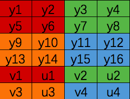
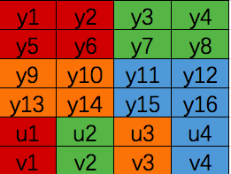
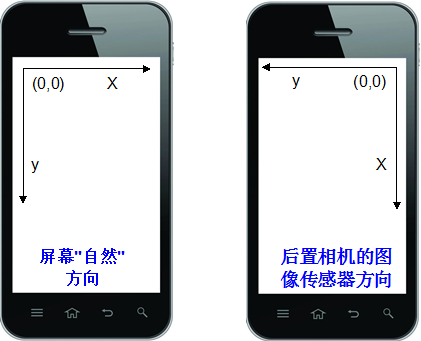
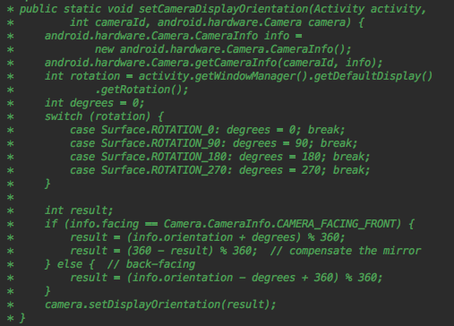
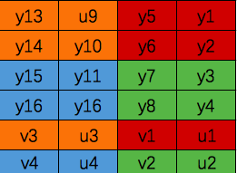

## NV21与I420

​	Android Camera对象通过setPreviewCallback 函数，在onPreviewFrame(byte[] data,Camera camera)中回调采集的数据就是NV21格式。而x264编码的输入数据却为I420格式。

因此，当我们采集到摄像头数据之后需要将NV21转为I420。

NV21和I420都是属于YUV420格式。而NV21是一种two-plane模式，即Y和UV分为两个Plane(平面)，但是UV（CbCr）交错存储，2个平面，而不是分为三个。这种排列方式被称之为YUV420SP，而I420则称之为YUV420P。(Y:明亮度、灰度，UV:色度、饱和度)

下图是大小为4x4的NV21数据:Y1、Y2、Y5、Y6共用V1与U1,......

而I420则是

可以看出无论是哪种排列方式，YUV420的数据量都为: w\*h+w/2\*h/2+w/2\*h/2 即为w\*h\*3/2

将NV21转位I420则为： 

​	Y数据按顺序完整复制,U数据则是从整个Y数据之后加一个字节再每隔一个字节取一次。

手机摄像头的图像数据来源于摄像头硬件的图像传感器，这个图像传感器被固定到手机上后会有一个默认的取景方向，这个取景方向坐标原点于手机横放时的左上角。当应用是横屏时候：图像传感器方向与屏幕自然方向原点一致。而当手机为竖屏时:

传感器与屏幕自然方向不一致，将图像传感器的坐标系逆时针旋转90度，才能显示到屏幕的坐标系上。所以看到的画面是逆时针旋转了90度的，因此我们需要将图像顺时针旋转90度才能看到正常的画面。而Camera对象提供一个`setDisplayOrientation`接口能够设置预览显示的角度：

根据文档，配置完Camera之后预览确实正常了，但是在onPreviewFrame中回调获得的数据依然是逆时针旋转了90度的。所以如果需要使用预览回调的数据，还需要对onPreviewFrame回调的byte[] 进行旋转。

即对NV21数据顺时针旋转90度。

旋转前：

旋转后:

